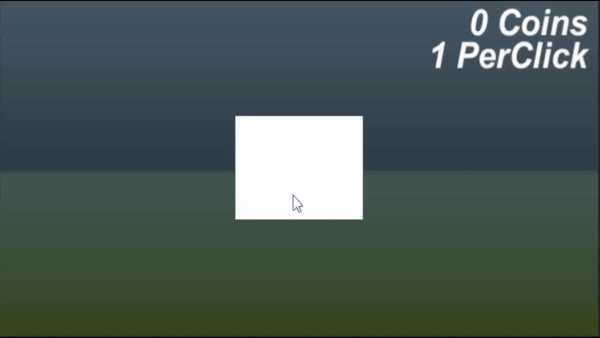
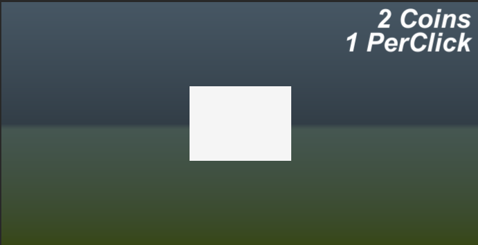
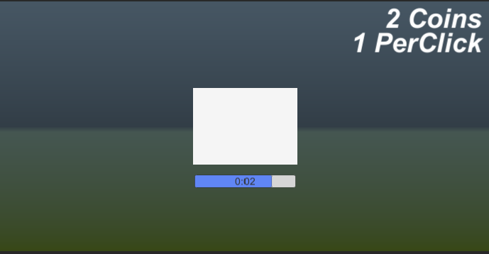

   <h1>
    Basic Clicker Game Prototype
  </h1>
  
  
A Prototype for educational purpose.

  

## Getting Started

Follow the below instructions to get started:

1. [Make sure you have all Requirements](#requirements)
2. [Download Source Code](#download)
3. Open Project in Unity and Enjoy!

## Requirements

Make sure you have the requirements before starting:

- [Unity Game Engine](https://unity3d.com)
- Basic Knowledge about Unity and C#

## Download

[:sparkles: Download Source Code](https://github.com/raxelf/Basic-Clicker-Game-Prototype/archive/refs/heads/main.zip)

## Screenshots

  

  

